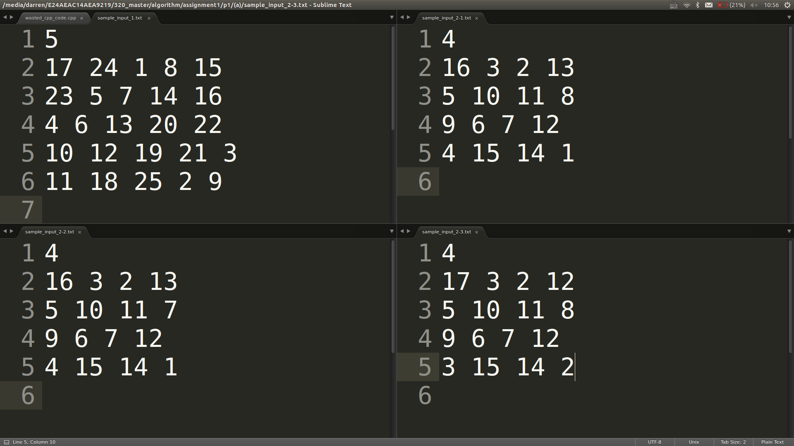
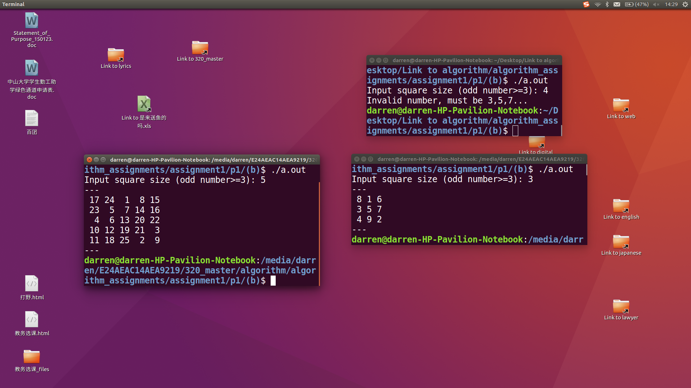
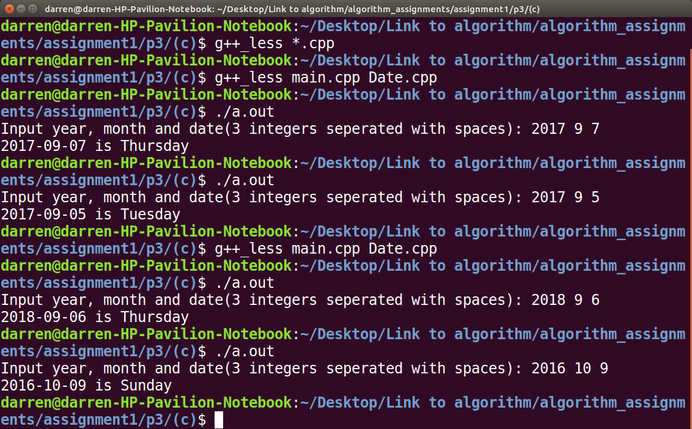
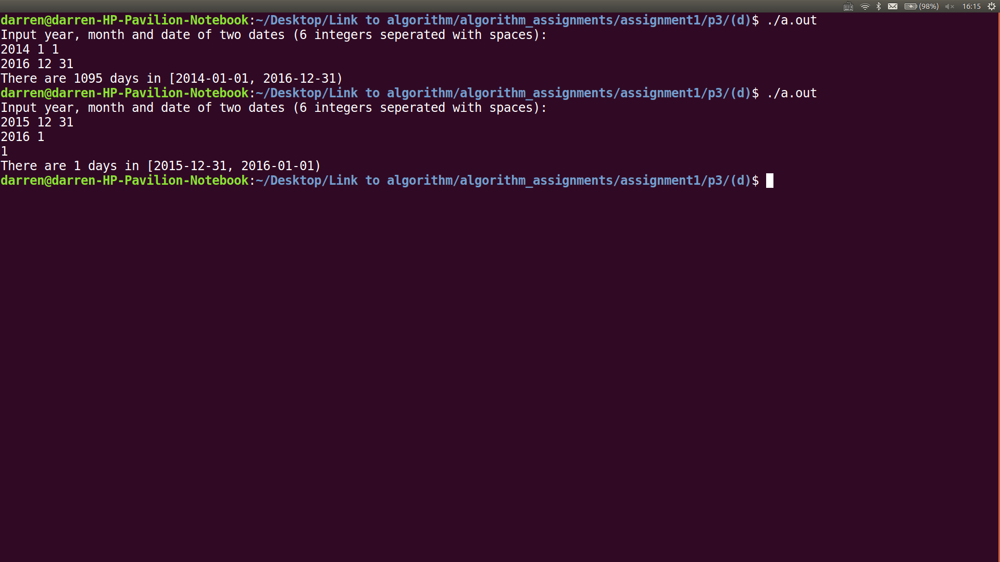
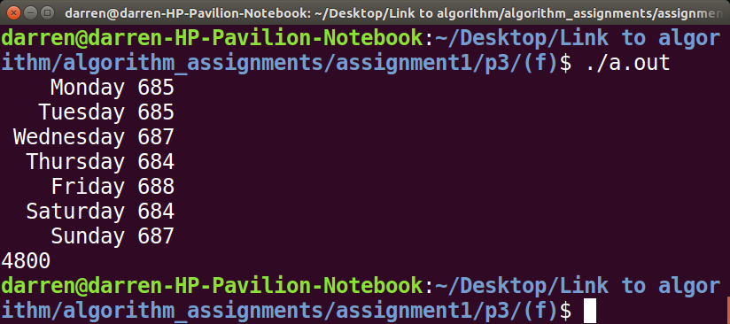

# p1
## (a)

* sum the first row
* check if other rows, columns and 2 diagonals sum to the same result

## (b)

# p3

## (c)

## (d)

## (e)
[click here for sulotion](p3/e/solution.txt)
## (f)

