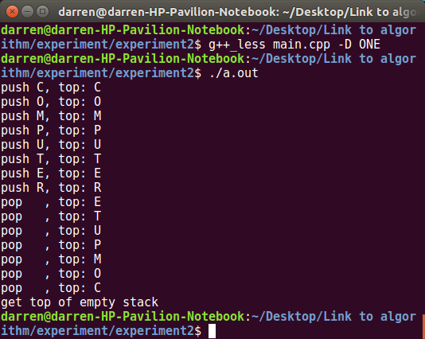

# Experiment2

### Notice

* All three programs are in the same main.cpp
* **it won't compile unless a paremeter "-D &lt;macro&gt;" is fed to g++**, where the &lt;macro&gt; should be ONE, TWO or three
* if your (stupid:smile:)compiler won't allow parameter-defined macros, feel free to add one at the beginning of main.cpp

### No1. Stack (linked-list)

* Max size is the RAM size
* throw runtime_error if pop/top an empty stack

### No2. Queue (fixed-size array, circular queue)

* fixed size (the secont *int* template argument)
* throw runtime_error when asking an empty queue to dequeue
* throw runtime_error when enqueuing a full queue
  

### No3. Menu driven

* self-explaining

